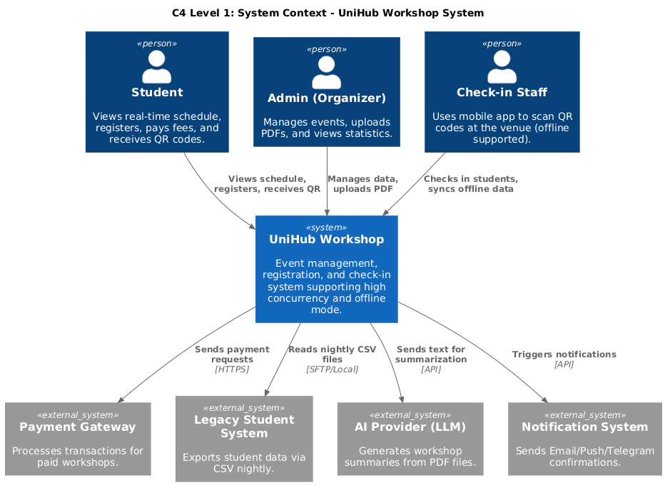
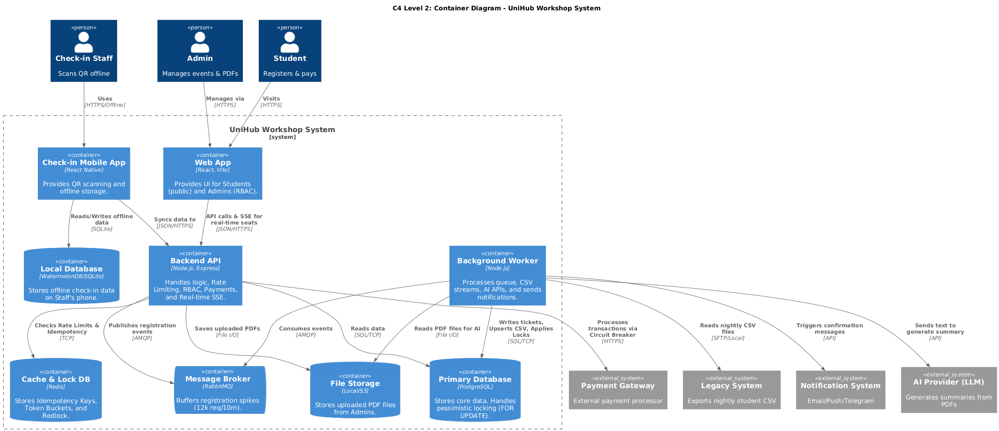
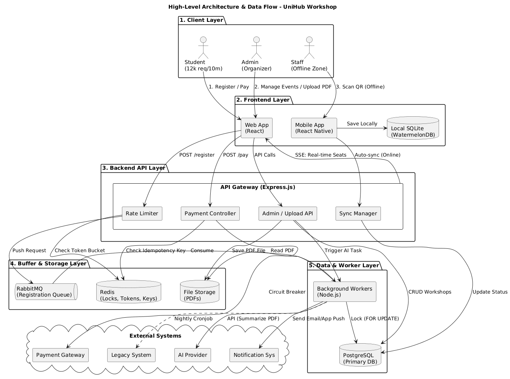

# UniHub Workshop — Technical Design

## Kiến trúc tổng thể
<!-- Mô tả architectural style được chọn và lý do.
     Hệ thống gồm những thành phần nào? Chúng giao tiếp với nhau như thế nào? -->

## C4 Diagram

### Level 1 — System Context
Sơ đồ này mô tả các tác nhân (Actors) và mối quan hệ của UniHub với các hệ thống bên ngoài.

*> [File PUML](./diagrams/1_context.puml)*

---

### Level 2 — Container Diagram
Sơ đồ phân rã hệ thống thành các Container có thể triển khai độc lập, thể hiện công nghệ (Node.js, PostgreSQL, Redis, RabbitMQ).

*> [File PUML](./diagrams/container.puml)*

---

## 2. High-Level Architecture & Data Flow
Sơ đồ mô tả chi tiết luồng dữ liệu khi có 12.000 sinh viên đăng ký cùng lúc, cơ chế xử lý Offline và Circuit Breaker cho thanh toán.

*> [File PUML](./diagrams/3_architecture.puml)*

## Thiết kế cơ sở dữ liệu
<!-- Loại database, lý do lựa chọn, schema các entity chính -->

## Thiết kế kiểm soát truy cập
<!-- Mô hình phân quyền, các nhóm người dùng, cách kiểm tra quyền tại từng điểm truy cập -->

## Thiết kế các cơ chế bảo vệ hệ thống

### Kiểm soát tải đột biến
<!-- Giải pháp, thuật toán, ngưỡng, hành vi khi vượt ngưỡng -->

### Xử lý cổng thanh toán không ổn định
<!-- Giải pháp, các trạng thái, ngưỡng kích hoạt, hành vi khi lỗi -->

### Chống trừ tiền hai lần
<!-- Cơ chế, nơi lưu trữ, TTL, luồng xử lý khi phát hiện trùng lặp -->

## Các quyết định kỹ thuật quan trọng (ADR)
<!-- Với mỗi quyết định lớn: lựa chọn gì, tại sao, đánh đổi gì.
     Ví dụ: SQL vs NoSQL, JWT vs Session, Kafka vs RabbitMQ, ... -->